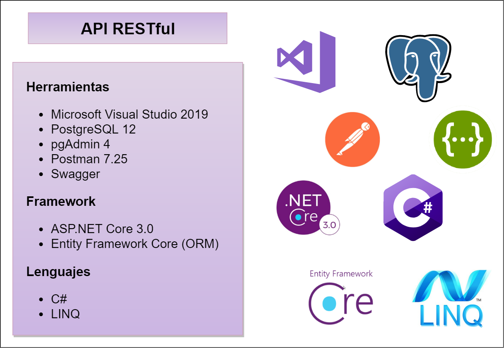
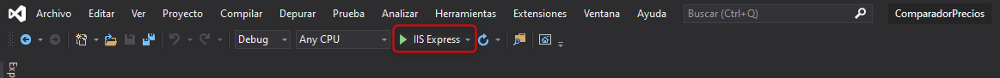
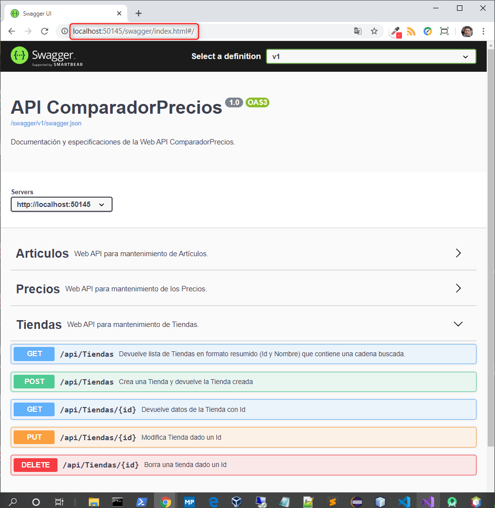
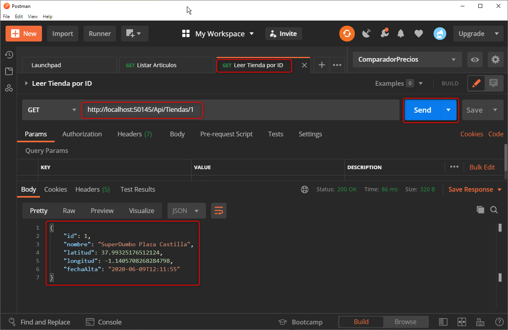
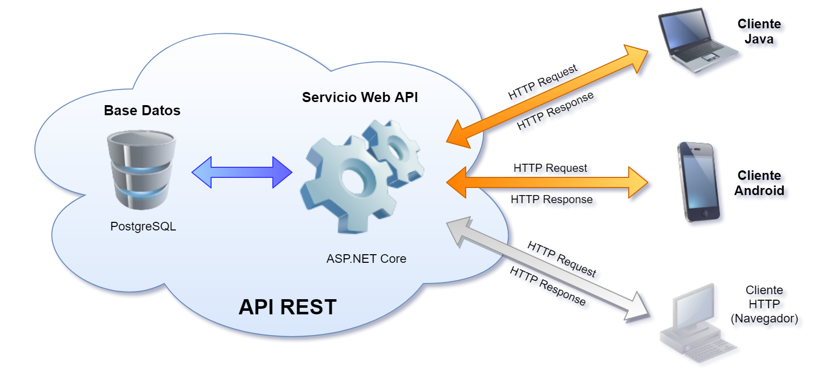
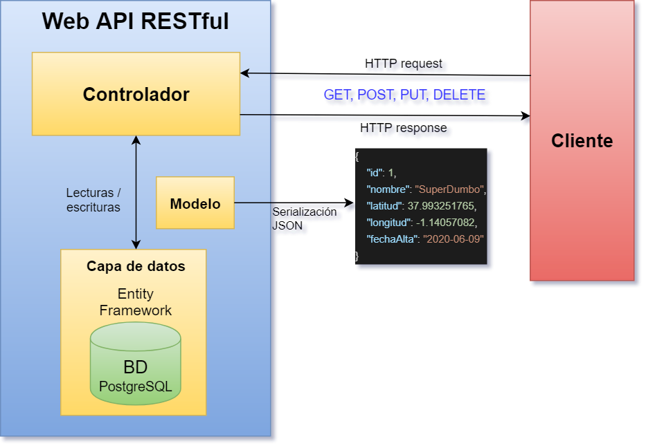
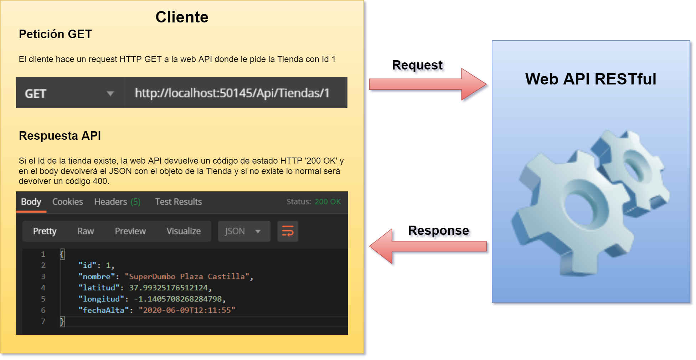
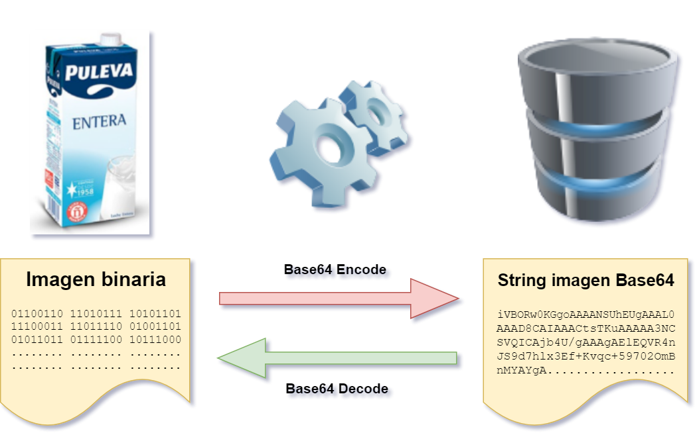
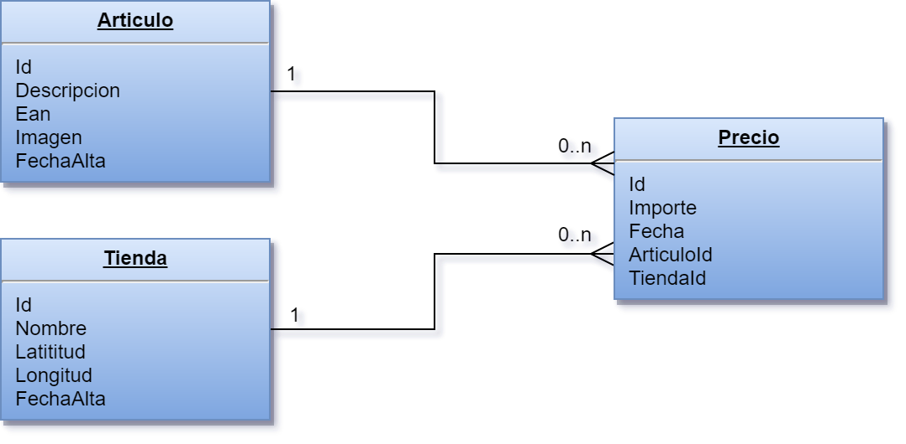

# ComparadorPrecios_WebAPI

Aplicación en **Visual Studio 2019** que implementa el **servicio API RESTful** de mi **Proyecto de Ciclo 2º DAM**.

## Introducción

El proyecto desarrollado pretende ser sobre todo una prueba de concepto de un sistema que consiste en lo siguiente:

- Un servicio web **API RESTful** en un servidor que responde a peticiones de clientes y que almacena sus datos en una base de datos PostgreSQL (Este proyecto)
- Una **aplicación cliente multiplataforma** desarrollada en **Java** y que consume los servicios proporcionados por la web API [(Enlace GitHub)](https://github.com/sbarquero/ComparadorPrecios_Java)
-  Una **aplicación cliente para Android** que consume los servicios de la web API [(Enlace GitHub)](https://github.com/sbarquero/ComparadorPrecios_Android) 

## Características

- El proyecto está desarrollado para la plataforma **.NET Core 3.1** utilizando **C#**. 
- Se emplea lo siguiente:

    - **Entity Framework** (ORM)
    - **LINQ** (Language Integrated Query)
    - **Swagger** (Documentación API REST)

- Utilizo **PostgreSQL** como gestor de base de datos y para acceder empleo el paquete *NuGet*

    - **Npgsql.EntityFrameworkCore.PostgreSQL**.

**Nota:** La carpeta **[basedatos](basedatos)** contiene los script necesarios para crear la base que utiliza la web API.

## Puesta en marcha

- Abrir la solución **ComparadorPrecios.sln** con **Visual Studio 2019** y una vez abierta
- Lanzar la aplicación, por ejemplo, con '**IIS Express**'

- Para acceder a la API utilizaremos peticiones HTTP al **puerto 50145** de **localhost**.

## Documentación de la API

Para acceder a la documentación que genera **Swagger** de la API ponemos en un navegador la siguiente dirección:

- **[http://localhost:50145/swagger](http://localhost:50145/swagger)**

## Peticiones a la API

Para hacer peticiones a la API podemos utilizar cualquier cliente que pueda hacer peticiones HTTP. En el proyecto desarrollado tenemos dos aplicaciones de ejemplo, una para **escritorio** desarrolladas en **Java** y otra para dispositivos **Android** desarrollada también en **Java**.

Podemos utilizar un programa como **Postman** para hacer peticiones y comprobar los resultados.
Adjunto un ejemplo en el que hago una petición `GET` de la tienda con `ID=1`.

---
## Más información sobre el proyecto

## Estructura del proyecto

## Diagrama interacción API REST y Cliente

## Ejemplo petición HTTP GET

## Codificación de imagen binaria en Base 64

## Diagrama de base de datos

